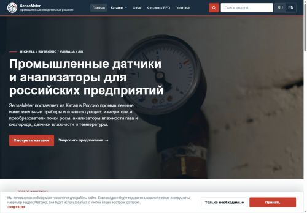
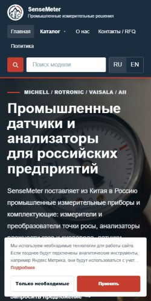

# SenseMeter 完整 SEO / GEO 审计

- 审计日期：2026-09-18
- 目标站点：https://sensemeter.ru/
- 审计版本：`8268420`
综合评分：**76 / 100（良好，但内容深度与可引用性仍是主要增长瓶颈）**

> 本分数是基于本报告所列权重的诊断评分，不是 Google、Yandex 或其他搜索引擎官方分数。

## 一、结论摘要

网站目前没有发现会导致全站无法抓取或无法索引的严重技术问题。HTTPS、主域跳转、robots、sitemap、canonical、hreflang、H1、结构化数据和移动端基础体验整体健康。线上首页和英文首页均能访问，首页已经清楚说明“从中国向俄罗斯供应工业仪表”。

当前最需要解决的不是“再加更多关键词”，而是**产品页和配件页的信息价值不足**：44 个产品页平均约 117 词，72 个配件详情页平均约 156 词；相比之下，10 个应用场景页平均约 656 词，明显更完整。搜索引擎可以发现这些短页面，但页面较难充分回答选型、工况、安装、兼容性、文件和交付问题，也较难成为 AI 搜索引用的可靠答案。

本轮没有发现已验证的 P0 严重故障。建议优先做小批量高质量试点，不要一次性机械扩写全部页面。

## 二、评分

| 类别 | 权重 | 得分 | 结论 |
|---|---:|---:|---|
| 技术 SEO | 22% | 90 | 抓取、索引指令、canonical、hreflang 健康 |
| 内容质量 | 23% | 57 | 产品与配件详情覆盖不足，是主要短板 |
| 页面 SEO | 20% | 76 | 标签完整，但 30 个标题和 73 个描述长度不理想 |
| 结构化数据 | 10% | 84 | JSON-LD 有效，实体和产品级语义仍可增强 |
| 性能 | 10% | 88 | LCP、CLS、TBT 良好；桌面 Speed Index 需复测 |
| GEO / AI 可见性 | 10% | 58 | 可抓取，但权威证据、引用来源和答案密度不足 |
| 图片 SEO | 5% | 94 | 908 次图片引用均有 alt 属性 |

加权总分：**76 / 100**。

## 三、审计范围与证据边界

### 已在线验证

- 俄语首页、英语首页和联系页返回 200。
- HTTP 跳转 HTTPS 为 301，`www` 跳转主域为 308。
- 线上首页 Lighthouse 实验室测试已完成。
- 生产表单 API 对无效请求返回明确的 `400 email_required`，说明路由仍然存在；本轮未发送真实询盘，不对邮件最终投递做新的破坏性测试。
- 公开搜索抽查可发现 SenseMeter 产品页，说明至少部分产品已被公开搜索系统抓取。

### 同版本完整构建验证

为避免对线上服务器进行 300 多次连续请求，完整路由抓取在与线上相同 Git 版本 `8268420` 的生产构建上执行，并对线上关键页面做交叉验证。完整抓取包括 148 个 sitemap URL、查询参数变体和 PDF 链接，共 310 个记录。

### 本轮不能确认

- 未获得 Yandex Webmaster、Google Search Console、GA4 或服务器访问日志权限，因此不能确认真实展示量、点击量、关键词排名、抓取频率和每个 URL 的实际索引状态。
- PageSpeed Insights 公共 API 返回 429 配额限制，因此没有 CrUX 真实用户数据；性能结论来自线上 Lighthouse 实验室测试。
- 公开搜索抽查不是专业外链数据库，不能替代 Ahrefs、Semrush、DataForSEO 或 Yandex Webmaster 的完整外链数据。

## 四、技术 SEO

### 通过项

- sitemap 包含 148 个可索引 URL；完整抓取中这些 URL 均可到达。
- 0 个 sitemap 孤立页，0 个首页无法到达的 sitemap URL。
- 0 个缺失 title，0 个缺失 description，0 个缺失 H1，0 个多 H1。
- 0 个 canonical 缺失或与预期不一致。
- 0 个 hreflang 错误；俄语、英语和 `x-default` 互相对应。
- 0 个 JSON-LD 解析错误。
- 6 个法律页面使用 `noindex, follow`，且不在 sitemap 中，设置合理。
- 抽查到的 22 个 PDF 均返回 200 和正确的 `application/pdf` 类型。
- 安全响应头包括 HSTS、`nosniff`、严格来源策略、SAMEORIGIN 和权限策略。

### 需要关注

1. **Googlebot 元数据流式输出需要加固（P1）**

   在当前 Next.js 生产构建中，YandexBot 和 Bingbot 获得位于 `<head>` 内的阻塞式元数据；普通 Chrome 和 Googlebot 路径使用流式元数据，Lighthouse 因而报告 meta description 缺失。页面源码仍包含 description，但建议在 Search Console 的已渲染 HTML 中验证，并评估通过 Next.js `htmlLimitedBots` 或等效方案让 Googlebot 也获得阻塞式 metadata。修改前必须做回归测试，避免影响首字节和页面渲染。

2. **18 个英文配件详情页层级为 4（P2）**

   页面并非孤立，但英文路径较深。应通过配件分类页、相关配件和应用页增加上下文内部链接，而不是为了缩短 URL 进行高风险改址。

3. **缺少 CSP（P3）**

   这不是直接排名因素，但可提升安全基线。上线前需要先兼容 Next.js、Yandex Metrica 和现有表单脚本，不能直接套用严格策略。

4. **`/llms.txt` 返回 404（P3）**

   不是搜索引擎索引要求，也不应被当作排名捷径；可作为 AI 系统的补充导航文件，但优先级低于页面内容和实体证据。

## 五、内容质量与搜索意图

| 页面类型 | 数量 | 平均词数 | 最低 | 最高 |
|---|---:|---:|---:|---:|
| 产品详情 | 44 | 117 | 90 | 152 |
| 配件详情 | 72 | 156 | 137 | 182 |
| 应用场景 | 10 | 656 | 611 | 716 |
| 目录页 | 2 | 536 | 528 | 544 |
| 首页 | 2 | 326 | 323 | 329 |
| 配件总览 | 2 | 174 | 171 | 176 |

按审计框架的页面类型覆盖阈值，128/148 个可索引页面被标记为内容覆盖不足。**这不代表搜索引擎按字数处罚页面**；它表示这些页面缺少支持采购和选型决策所需的信息。

### 产品页最缺少的内容

- 适用介质、测量任务和不适用条件。
- 样气条件、压力处理、过滤和流量要求。
- 安装方式、输出、供电、通讯和系统集成说明。
- 型号差异、选型流程、可选附件和兼容性。
- 可提供的 PDF、证书、校准和质量文件说明。
- 从中国发往俄罗斯时可选的物流、贸易条款和报价所需信息。

所有技术参数必须来自制造商资料或已确认的商业文件；不能为了 SEO 填写未经验证的范围、精度、认证或交期。

### 竞争内容抽查

公开搜索结果中，俄罗斯本地竞品页面通常提供更长的技术说明、原理、工况、认证或型号对比。例如：

- https://bacs.ru/products/hygroscan/
- https://vympel.group/products/gas-analyzers/
- https://xena-vaisala.ru/products/promishlennie_izmerenija/produktsija_28/vlazhnost_i_tochka_rosi/moduli_42/dmt143/

这不是对其参数真实性的背书，而是说明目标搜索结果偏好能够完成技术选型的页面类型。

## 六、页面 SEO

- 30 个页面标题不在 30–60 字符的审计建议范围内：14 个配件页、11 个产品页、3 个应用页、1 个目录页和英文首页。
- 73 个页面描述不在 120–160 字符范围内，其中 62 个来自配件详情页，11 个来自其他静态页。
- 无重复 title、description 或完整正文哈希。
- 标题和描述长度是展示优化问题，不应为了达到字符数机械堆词。
- 关键词应与页面类型绑定：类别页覆盖“工业露点仪/气体水分分析仪/工业湿度传感器/氧气分析仪”等需求；产品页覆盖型号与任务；应用页覆盖压缩空气、天然气、手套箱、环境试验箱等场景。

## 七、结构化数据

### 当前有效

- 站点级 `Organization`、`WebSite`、`SearchAction`。
- 126 个详情或层级页面含 `BreadcrumbList`。
- 10 个应用页面含 `FAQPage`。
- 所有 JSON-LD 均可解析。

### 建议

- 在确认字段真实后，为产品详情增加基础 `Product` 实体：名称、品牌、型号、描述、图片、URL 和经过验证的附加属性。
- 没有公开价格、库存和固定交易条件时，不要伪造 `Offer`。
- Organization 的 `sameAs` 当前信号较少；仅添加真实、可公开验证并由企业控制的资料页。
- FAQ 结构化数据只保留页面上真实可见的问答，不能批量生成隐藏问答。

## 八、性能与移动体验

线上首页 Lighthouse 结果：

| 指标 | 移动端 | 桌面端 |
|---|---:|---:|
| Performance | 96 | 84 |
| Accessibility | 100 | 100 |
| Best Practices | 96 | 96 |
| SEO | 92 | 92 |
| FCP | 1.2s | 1.2s |
| LCP | 1.6s | 1.3s |
| TBT | 60ms | 0ms |
| CLS | 0 | 0 |
| Speed Index | 5.1s | 11.7s |
| 传输体积 | 630 KiB | 764 KiB |

LCP、TBT 和 CLS 表现良好。桌面 Speed Index 与 LCP 差异较大，可能受首屏视频、动画、Cookie 横幅和实验环境最终视觉完成判定影响，应在稳定网络下重复 3 次并取中位数后再决定是否改动。审计环境中 Yandex Metrica 脚本出现一次连接关闭，也应先观察真实日志再处理。

实验室截图：

### 搜索体验与转化观察

- 桌面首屏能快速识别品牌、工业仪表类别、供应方向和两个主要操作，信息层级清楚。
- 移动端导航、搜索和语言切换占用较多首屏高度；Cookie 横幅会遮挡部分 hero 文案和操作按钮。它不构成索引障碍，但可能降低第一次访问的内容可见性和转化。
- 优先调整移动端 Cookie 横幅高度与按钮排列，并确保“仅必要”和“接受”都容易操作；不要为了腾空间弱化合规说明。

## 九、图片 SEO

- 148 个可索引页面中共有 908 次图片引用。
- 0 个图片缺失 alt 属性。
- 248 次为空 alt，主要用于装饰性或重复展示图片；这是可访问性允许的做法，但上线前应抽查，确保产品主图没有被误标为空。
- 当前图片不是主要 SEO 瓶颈。继续保持明确尺寸、响应式输出和稳定布局即可。

## 十、GEO / AI 搜索可见性

### 优势

- robots 通配规则允许常见 AI 抓取器访问。
- 页面核心内容在服务端 HTML 中可读取。
- 首页清楚陈述品牌、产品范围、供应方向和目标市场。
- 应用场景页已有较好的问题—方案结构和 FAQ。

### 短板

- 产品页和配件页缺少足够的答案密度，AI 很难从页面中抽取完整、可引用的选型结论。
- 缺少原始案例、工程师审核、引用来源、发布日期/更新日期和可验证的交付证据。
- 企业实体外部资料较少，公开搜索抽查未发现明显的独立行业引用；这不是完整外链结论，但说明需要建设真实的行业资料与合作伙伴信号。
- 没有 `llms.txt`，但其优先级低于内容可信度。

### GEO 建议

1. 每个重点产品页增加“适合什么任务 / 不适合什么任务 / 报价前需要哪些参数”的直接答案。
2. 发布由技术人员审核的选型说明，并标注资料来源和更新时间。
3. 用真实项目经验制作 3–5 个匿名案例：介质、问题、选型逻辑、安装条件、交付内容和结果；不得虚构客户与效果。
4. 为关键术语建立简洁定义，并从应用页链接到对应产品与资料。
5. `llms.txt` 只作为最后的导航补充，不代替内容建设。

## 十一、优先级

### P1：未来 1–2 周

1. 在 Yandex Webmaster 和 Google Search Console 导出实际索引、排除、展示和点击数据。
2. 选 5 个高商业价值产品页和 5 个配件页做内容试点，不要一次扩写 116 页。
3. 验证 Googlebot 渲染后的 metadata；确认问题后再加固流式 metadata。
4. 批量修正最明显的 title/description 长度问题，并保持俄语搜索意图自然。

### P2：未来 3–6 周

1. 将试点模板扩展到有真实资料支持的页面。
2. 增加类别页到产品、应用页到产品、产品到配件的上下文链接。
3. 添加经过验证的 Product 实体数据。
4. 建立真实案例、技术资料来源和审核人机制。

### P3：未来 2–3 个月

1. 根据站长平台查询数据新增俄罗斯市场专题，而不是按关键词列表批量造页。
2. 获取制造商、行业目录、合作伙伴和技术媒体的真实引用与链接。
3. 复测真实用户性能，并在有现场数据支持时优化首屏媒体。
4. 评估 CSP 和 `llms.txt`。

## 十二、验收指标

- 试点页面上线 4–8 周后，与未修改同类页面对照展示量、点击量、平均排名和询盘。
- 重点页面的有效索引率、非品牌查询曝光和有意向询盘增长。
- 产品页覆盖明确的任务、工况、选型、附件、文档与询价信息。
- 新增参数均可追溯到制造商资料或正式确认文件。
- 页面改动不影响 `/api/rfq-email`、联系表单和邮件配置。

## 十三、总体判断

SenseMeter 已具备健康的双语技术底座，当前不需要大规模改版或制造更多页面。最有可能带来增长的路线是：**先取得站长平台真实数据，再用 10 个高价值页面验证“更完整的工程选型内容 + 更明确的供应与报价信息”是否提升曝光和询盘，验证后再扩展。**
